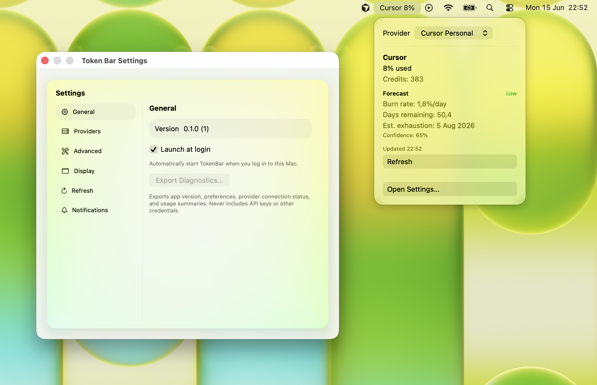

<div>
<h3>Token Bar</h3>
<p>TokenBar is a macOS menu bar app that tracks AI usage across multiple providers in one place. See tokens, credits, spend, quotas, and burn rate at a glance—without opening separate provider dashboards.
</p>
<a href="https://github.com/token-bar/token-bar/releases"></a>
</div>

<br/><br/>

<div align="center">

[](https://github.com/token-bar/token-bar/releases)
[](https://github.com/token-bar/token-bar/releases)
[](https://github.com/token-bar/token-bar/blob/main/LICENSE)
[](https://github.com/token-bar/token-bar)
[](https://github.com/token-bar/token-bar/actions/workflows/ci.yml)

<br/>
<br/>

<br/>

</div>

<hr>

## Features

- **Menu bar indicator** — percentage, progress bar, spend, credits, burn rate, or multi-provider aggregate
- **Provider connectors** — Cursor (personal & team), OpenAI, Anthropic, and custom HTTP proxy
- **Usage forecasting** — burn rate and exhaustion estimates from local history
- **Alerts** — native macOS notifications at 50%, 75%, 90%, 100%, and forecasted exhaustion
- **Widget** — Notification Center / Desktop widget with cached usage
- **Settings** — connect providers, configure refresh intervals, display mode, and alert preferences
- **Privacy-first** — credentials in Keychain; diagnostics export excludes secrets
- **Demo provider** — simulate usage for testing without real API accounts

## Supported providers

| Provider | Auth |
|----------|------|
| Cursor Personal | Session cookie from dashboard |
| Cursor Team | Admin API key |
| OpenAI | Organization Admin API key |
| Anthropic | Admin API key |
| Custom Proxy | Optional bearer token + canonical JSON endpoint |
| Demo Provider | No credentials (advanced / testing) |

See [docs/development.md](docs/development.md) for connection steps.

## Requirements

- **macOS 26** (Tahoe) or later
- Apple Silicon or Intel Mac

## Install

1. Download from **[token-bar.pages.dev](https://token-bar.pages.dev)** or [GitHub Releases](https://github.com/token-bar/token-bar/releases)
2. Open the DMG and drag **TokenBar** to Applications
3. Launch TokenBar — it appears in the menu bar (no Dock icon)

On first launch, macOS may ask you to allow notifications if you enable usage alerts.

## Quick start

1. Click the menu bar icon → **Open Settings**
2. Under **Providers**, connect a provider (e.g. **Cursor Personal** or **Demo Provider**)
3. Choose a **Display mode** under **General**
4. Use **Refresh Now** or enable automatic refresh

Optional: add the **TokenBar** widget from Notification Center or the Desktop widget gallery after the first refresh.

## Development

```bash
git clone https://github.com/token-bar/token-bar.git
cd token-bar
open TokenBar.xcodeproj
```

- **Xcode 26+** and **macOS 26+** required (matches the app deployment target)
- Run tests with **⌘U** or see [CI](.github/workflows/ci.yml)
- Follow the spec-driven workflow in [INSTRUCTIONS.md](INSTRUCTIONS.md)

```bash
./scripts/bump-version.sh 0.2.0   # bump marketing version + build number
```

## Documentation

| Doc | Description |
|-----|-------------|
| [docs/architecture.md](docs/architecture.md) | System design and layers |
| [docs/development.md](docs/development.md) | Setup, providers, widget |
| [docs/release-process.md](docs/release-process.md) | Versioning and releases |
| [specs/](specs/) | Feature specifications |
| [CHANGELOG.md](CHANGELOG.md) | Release history |

## Contributing

Contributions are welcome. Please read [CONTRIBUTING.md](CONTRIBUTING.md) and [CODE_OF_CONDUCT.md](CODE_OF_CONDUCT.md) before opening a pull request.

## Security

To report a vulnerability, see [SECURITY.md](SECURITY.md).

## License

TokenBar is released under the [MIT License](LICENSE).
