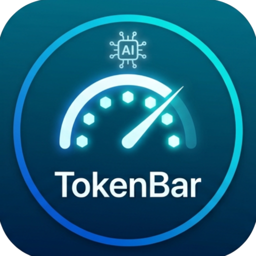
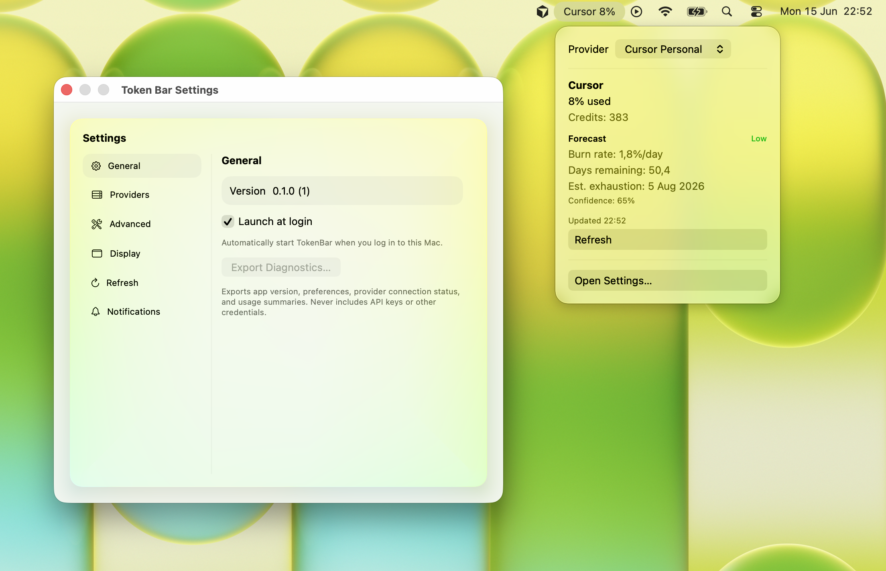

<div>
<h3>Token Bar</h3>
<p>TokenBar is a macOS menu bar app that tracks AI usage across multiple providers in one place. See tokens, credits, spend, quotas, and burn rate at a glance—without opening separate provider dashboards.
</p>
<a href="https://apps.apple.com/app/id6805913901"></a>
</div>

<br/><br/>

<div align="center">

[](https://apps.apple.com/app/id6805913901)
[](https://github.com/token-bar/token-bar/blob/main/LICENSE)
[](https://github.com/token-bar/token-bar)
[](https://github.com/token-bar/token-bar/actions/workflows/ci.yml)

<br/>
<br/>

<br/>

</div>

<hr>

## Features

- **Menu bar indicator** — percentage, progress bar, spend, credits, burn rate, or multi-provider aggregate
- **Provider connectors** — Cursor (personal & team), OpenAI, Anthropic, and custom HTTP proxy
- **Usage forecasting** — burn rate and exhaustion estimates from local history
- **Alerts** — native macOS notifications at 50%, 75%, 90%, 100%, and forecasted exhaustion
- **Widget** — Notification Center / Desktop widget with cached usage
- **Settings** — connect providers, configure refresh intervals, display mode, and alert preferences
- **Privacy-first** — credentials in Keychain; diagnostics export excludes secrets
- **Demo provider** — simulate usage for testing without real API accounts

Landing site: [token-bar.pages.dev](https://token-bar.pages.dev)

## Supported providers

| Provider | Auth |
|----------|------|
| Cursor Personal | Session cookie from dashboard |
| Cursor Team | Admin API key |
| OpenAI | Organization Admin API key |
| Anthropic | Admin API key |
| Custom Proxy | Optional bearer token + canonical JSON endpoint |
| Demo Provider | No credentials (advanced / testing) |

See [docs/development.md](docs/development.md) for connection steps.

## Install

Requires **macOS 26** (Tahoe) or later (Apple Silicon or Intel).

1. Download **TokenBar** from the [Mac App Store](https://apps.apple.com/app/id6805913901)
2. Launch the app — it lives in the menu bar (no Dock icon)

On first launch, macOS may ask you to allow notifications if you enable usage alerts.

## Quick start

1. Click the menu bar icon → **Open Settings**
2. Under **Providers**, connect a provider (e.g. **Demo Provider** for testing, or **Cursor Personal**)
3. Choose a **Display mode** under **General**
4. Use **Refresh Now** or enable automatic refresh

Optional: add the **TokenBar** widget from Notification Center or the Desktop widget gallery after the first refresh.

## Development

End users install from the **Mac App Store**. To run from source, clone the repo and build in Xcode.

Requires **Xcode 26** and **macOS 26** or later.

```bash
git clone https://github.com/token-bar/token-bar.git
cd token-bar
open "src/TokenBar.xcodeproj"
```

Select **My Mac** as the run destination, then **Run** (⌘R).

- Run tests with **⌘U** or see [CI](.github/workflows/ci.yml)
- Follow the spec-driven workflow in [INSTRUCTIONS.md](INSTRUCTIONS.md)
- Mac App Store releases: [docs/release-process.md](docs/release-process.md)

```bash
./scripts/bump-version.sh 0.2.0   # bump marketing version + build number
```

## Repository layout

| Path | Purpose |
|------|---------|
| `src/TokenBar/App/` | App entry point, environment, and lifecycle |
| `src/TokenBar/Domain/` | Usage models, aggregation, forecasting, and alert evaluation |
| `src/TokenBar/Providers/` | Cursor, OpenAI, Anthropic, proxy, and demo provider connectors |
| `src/TokenBar/Services/` | Keychain-backed storage, refresh scheduler, notifications, widget snapshots |
| `src/TokenBar/UI/` | Menu bar panel, settings screens, and shared design components |
| `src/TokenBarWidget/` | Notification Center / Desktop widget extension |
| `src/TokenBarTests/` | Unit tests for domain, providers, and services |
| `website/` | Marketing site (React + Vite, Cloudflare Pages) |
| `specs/` | Numbered feature specifications |
| `docs/` | Architecture, development, and release guides |

Each Swift source file includes a header comment describing its role. Key types use `///` documentation where helpful.

## Data & privacy

Provider credentials stay in **Keychain**. Usage history and preferences stay **on device**. No TokenBar account or backend required.

## Documentation

| Doc | Description |
|-----|-------------|
| [docs/README.md](docs/README.md) | Documentation index |
| [docs/architecture.md](docs/architecture.md) | System design and layers |
| [docs/development.md](docs/development.md) | Setup, providers, widget |
| [docs/release-process.md](docs/release-process.md) | Mac App Store versioning and release |
| [docs/provider-framework.md](docs/provider-framework.md) | Provider plugin layer |
| [docs/app-store-connect.md](docs/app-store-connect.md) | App Store listing copy |
| [.cursor/rules.md](.cursor/rules.md) | Cursor AI editing rules |
| [.agents/skills/README.md](.agents/skills/README.md) | Agent skills catalog |
| [specs/](specs/) | Feature specifications |
| [CHANGELOG.md](CHANGELOG.md) | Release history |

## Contributing

Contributions are welcome. Please read [CONTRIBUTING.md](CONTRIBUTING.md) and [CODE_OF_CONDUCT.md](CODE_OF_CONDUCT.md) before opening a pull request.

## Security

To report a vulnerability, see [SECURITY.md](SECURITY.md).

## License

MIT — see [LICENSE](LICENSE).

---

## Repository documents

**README** | [Docs](docs/README.md) | [INSTRUCTIONS](INSTRUCTIONS.md) | [CHANGELOG](CHANGELOG.md) | [CONTRIBUTING](CONTRIBUTING.md) | [SECURITY](SECURITY.md) | [CODE_OF_CONDUCT](CODE_OF_CONDUCT.md)
